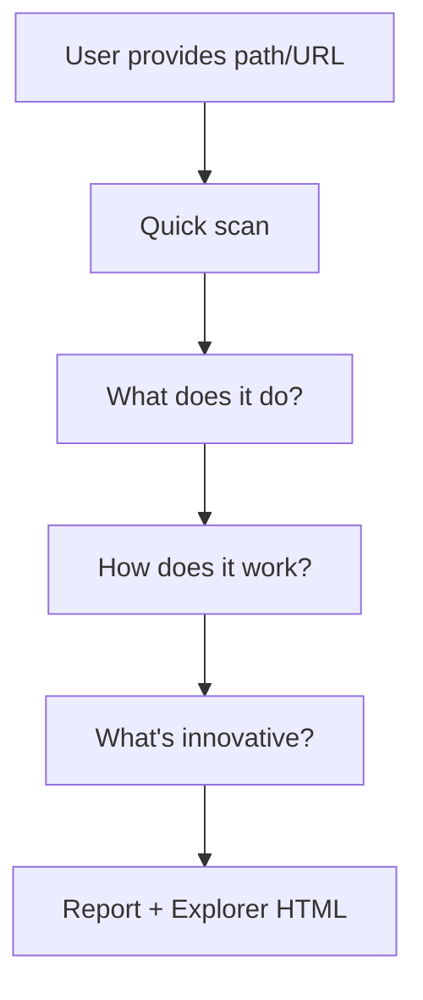

# Project Analyzer Skills

分析任何代码库，回答三个核心问题：**做了什么**、**流程什么样**、**创新在哪**。

生成结构化报告 + 交互式架构浏览器。

## Features

- **3 个核心问题** — 不是生成一堆图，而是回答"做了什么、怎么跑的、有什么不同"
- **交互式架构浏览器** — 分层折叠树、依赖链迷你图、搜索、展开/收起
- **结构化报告** — 一份 README 说清楚项目全貌
- **自动清理** — 重新分析时自动删除旧文件
- **自包含** — HTML 文件 ~20KB，无外部依赖，离线可用

## Installation

```bash
npx skills add zhangclaus/project-analyzer-skills --agent claude-code -g
```

Works with Claude Code, Cursor, Windsurf, Copilot CLI, and other [Agent Skills compatible tools](https://agentskills.io/clients).

## Usage

Just ask naturally:

```
"分析这个项目"
"帮我理解这个代码库"
"explain how this project works"
"项目详解 /path/to/local/project"
"codebase overview"
```

Or invoke directly:

```
/project-analyzer-skills
```

## How It Works



1. **Input** — Provide a local path or GitHub URL
2. **Quick Scan** — Read README, config files, directory structure
3. **Q1: What does it do?** — Map modules, classify layers, annotate WHY
4. **Q2: How does it work?** — Trace the main workflow end-to-end
5. **Q3: What's innovative?** — Identify key design decisions
6. **Output** — One report + one interactive HTML

## Output

```
docs/analysis/<project-name>/
├── README.md                    # 结构化报告（三个问题的回答）
└── architecture-explorer.html   # 交互式架构浏览器
```

### Report (README.md)

三个部分：
- **What It Does** — 项目概览、核心功能、模块表（层 + WHY）
- **How It Works** — 主流程 Mermaid 图 + 逐步解释
- **What's Innovative** — 3-5 个关键设计决策 + 为什么这样做

### Explorer (architecture-explorer.html)

- 左侧：按层折叠的模块树
- 右侧：点击模块 → 递归展示上下游依赖链（SVG 迷你图）
- 搜索、展开/收起

## Supported Languages

Any language. Best results with: TypeScript/JavaScript, Python, Go, Rust, Java/Kotlin, Ruby, PHP, C/C++.

## License

MIT
