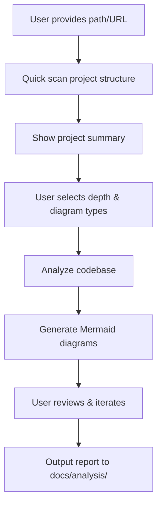
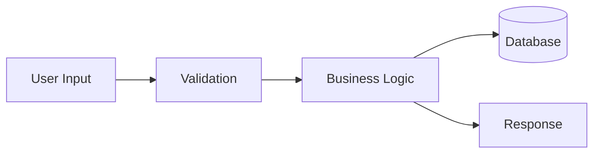
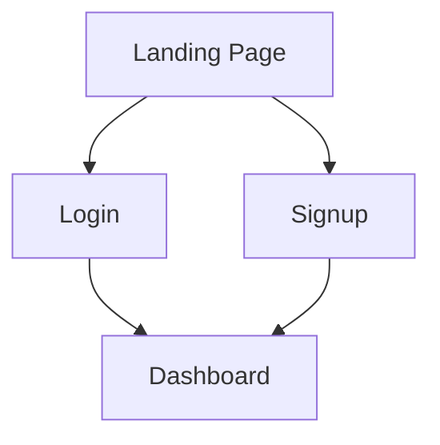

# Project Analyzer Skills

An [Agent Skills](https://agentskills.io/specification) skill that generates visual documentation for any codebase — architecture diagrams, data flow diagrams, functional flow charts, and user interaction patterns.

Give it a local path or a GitHub URL, and it will analyze the project and produce structured Markdown reports with embedded Mermaid diagrams.


## Features

- **Interactive HTML diagrams** — Architecture Explorer with layered tree, dependency mini-graphs, search, expand/collapse
- **Mermaid markdown** — Data Flow & User Interaction for GitHub compatibility
- **3 analysis depths** — Overview, Architecture-level, Deep (function-level)
- **Multiple input sources** — Local directory or GitHub URL
- **Interactive workflow** — Step-by-step guidance with confirmation at each stage
- **Configurable** — Choose depth, diagram types, and output format

## Installation

```bash
npx skills add zhangclaus/project-analyzer-skills --agent claude-code -g
```

Works with Claude Code, Cursor, Windsurf, Copilot CLI, and other [Agent Skills compatible tools](https://agentskills.io/clients).

## Usage

Just ask naturally:

```
"分析这个项目"
"帮我理解这个代码库"
"generate architecture diagram for https://github.com/expressjs/express"
"explain how this project works"
"项目详解 /path/to/local/project"
"codebase overview"
```

Or invoke directly:

```
/project-analyzer-skills
```

## How It Works



### Step by step

1. **Input** — Provide a local path or GitHub URL
2. **Scan** — The skill reads README, package.json/Cargo.toml/go.mod, and directory structure
3. **Select** — Choose analysis depth (Overview / Architecture / Deep) and diagram types
4. **Analyze** — Uses Glob, Read, Grep to explore the codebase
5. **Generate** — Produces Mermaid diagrams with explanations
6. **Review** — Confirm each diagram, iterate if needed
7. **Output** — Saves structured report to `docs/analysis/<project-name>/`

## Output Structure

```
docs/analysis/<project-name>/
├── README.md                           # Overview report with index
├── architecture/
│   ├── architecture-explorer.html      # Interactive architecture explorer (self-contained)
│   └── tech-stack.md                   # Tech stack analysis
├── data-flow/
│   ├── data-flow-diagram.md           # Mermaid
│   └── data-model.md                  # Mermaid
├── functional-flow/
│   ├── functional-explorer.html       # Interactive functional flow explorer (self-contained)
│   └── state-machines.md             # Mermaid state machines
└── user-interaction/
    ├── user-flow.md                   # Mermaid
    └── page-navigation.md             # Mermaid
```

## Diagram Types

### Architecture

Module dependencies, component relationships, tech stack overview. **Output: Interactive HTML (Architecture Explorer)** — layered tree with dependency mini-graphs, search, expand/collapse.

### Data Flow

Data entry points, transformations, storage, and outputs.



### Functional Flow

Core business logic, function call chains, state machines. **Output: Interactive HTML (Architecture Explorer)** for call chains, **Mermaid** for state machines.

### User Interaction

User entry points, navigation paths, interaction sequences.



## Analysis Depths

| Depth | Scope | Best For |
|-------|-------|----------|
| **Overview** | Directory structure, tech stack, module boundaries | First look at a project |
| **Architecture** | Module dependencies, APIs, data models | Understanding system design |
| **Deep** | Function call chains, conditionals, state machines | Debugging or contributing |

## Supported Languages

The skill works with any language by analyzing directory structure and imports. Best results with:

- TypeScript / JavaScript
- Python
- Go
- Rust
- Java / Kotlin
- Ruby
- PHP
- C / C++

## Project Structure

```
project-analyzer-skills/
├── SKILL.md                        # Main skill orchestrator
├── references/
│   ├── architecture.md             # Architecture analysis guide
│   ├── data-flow.md                # Data flow analysis guide
│   ├── functional-flow.md          # Functional flow analysis guide
│   └── user-interaction.md         # User interaction flow guide
└── templates/
    └── report-template.md          # Output report template
```

## Contributing

Contributions welcome! The skill follows the [Agent Skills specification](https://agentskills.io/specification).

To add a new diagram type:
1. Create a reference file in `references/`
2. Add the dispatch entry in `SKILL.md`
3. Update this README

## License

MIT
