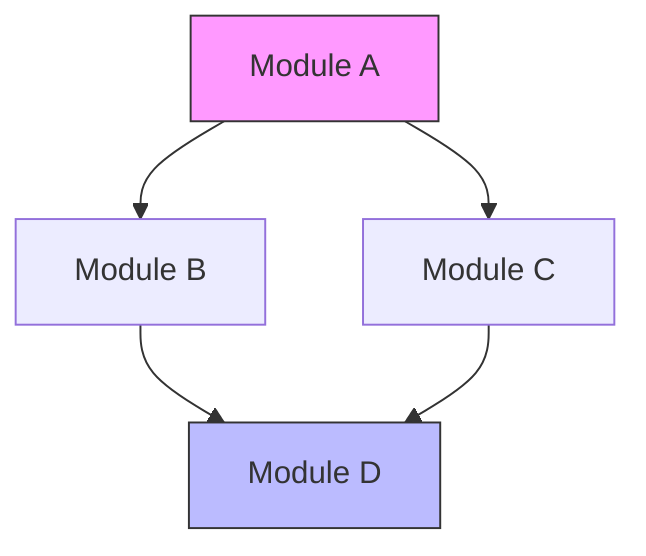
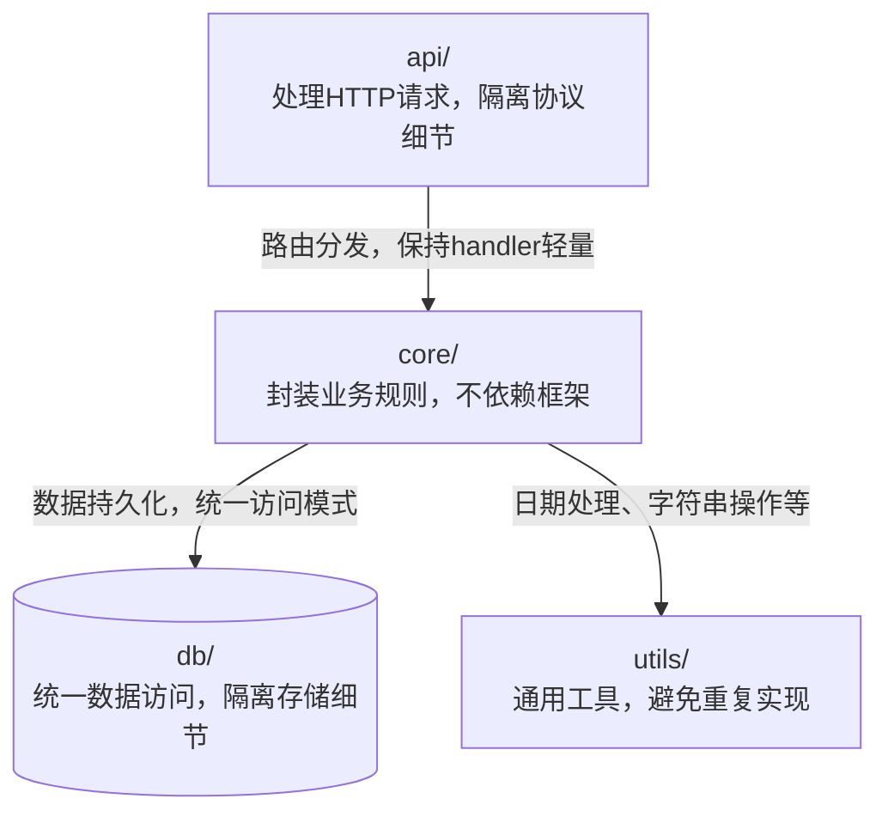
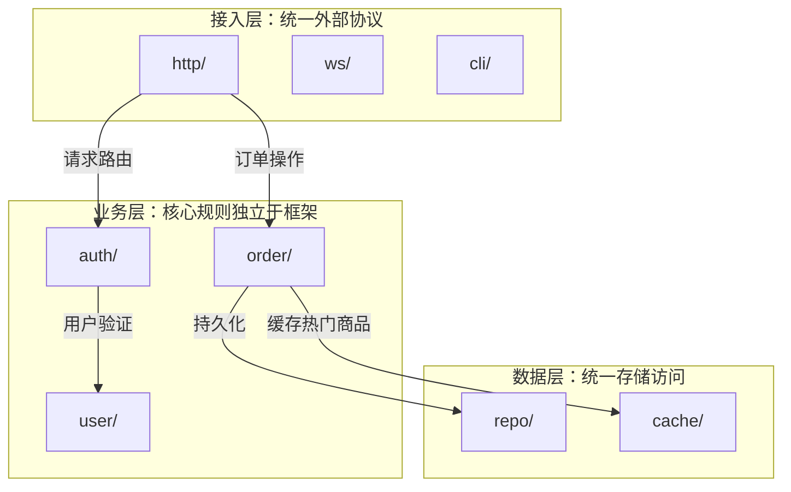
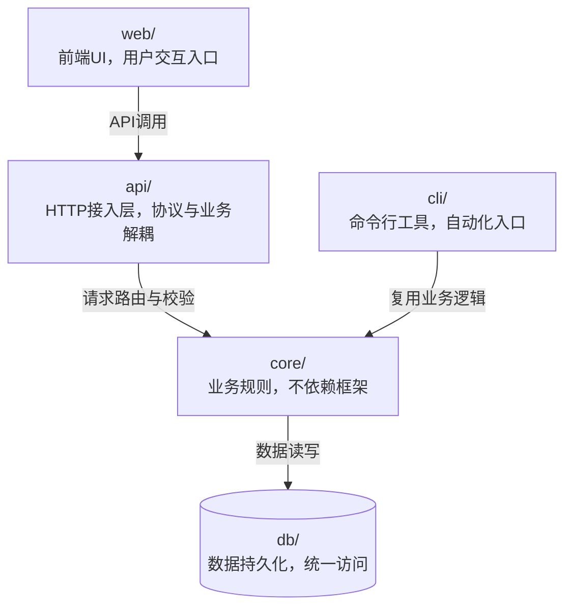
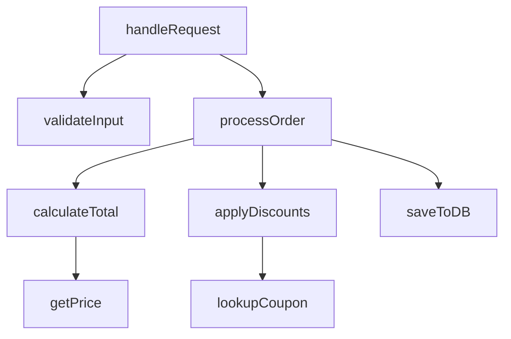
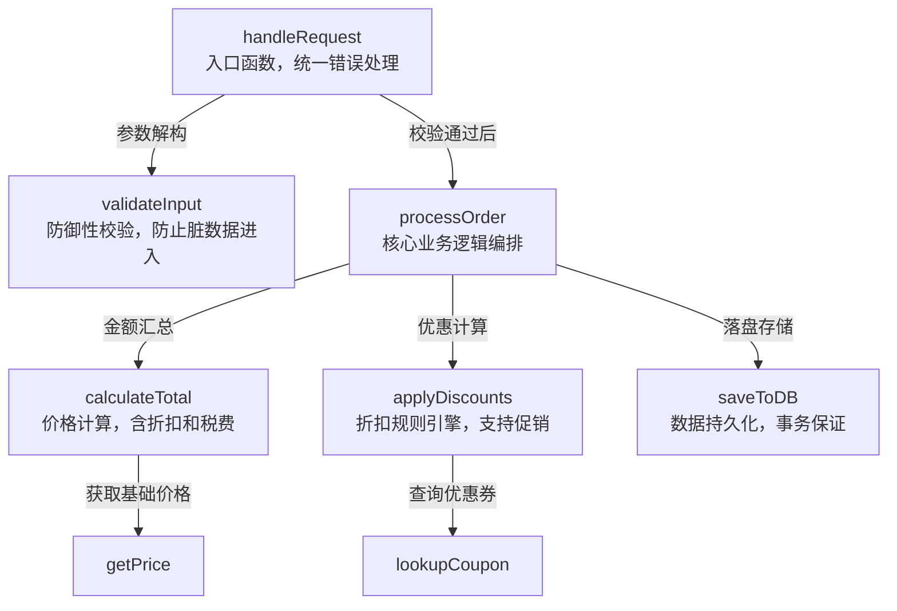
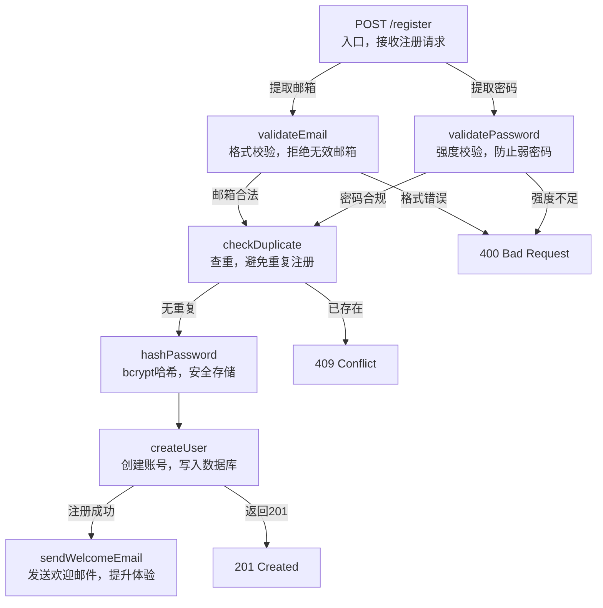
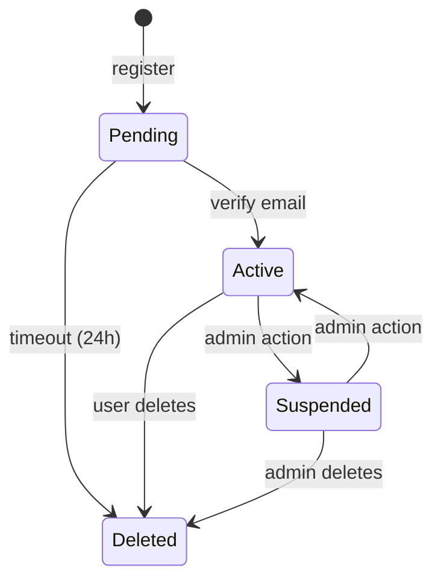

# WHY-Driven Diagram Annotations — Implementation Plan

> **For agentic workers:** REQUIRED SUB-SKILL: Use superpowers:subagent-driven-development (recommended) or superpowers:executing-plans to implement this plan task-by-task. Steps use checkbox (`- [ ]`) syntax for tracking.

**Goal:** Add WHY annotations to architecture and functional flow diagrams, upgrading them from "showing structure" to "explaining design decisions."

**Architecture:** Extend the existing prompt-based skill files (SKILL.md + references/) with WHY inference rules, trigger conditions, and updated Mermaid templates. No executable code — all changes are to Markdown instruction files that guide the agent's analysis behavior.

**Tech Stack:** Markdown, Mermaid diagram syntax

**Spec:** `docs/superpowers/specs/2026-05-14-why-driven-annotations-design.md`

---

### Task 1: Add WHY Annotation Rules to SKILL.md

**Files:**
- Modify: `SKILL.md:84-98` (Analysis Execution section)

- [ ] **Step 1: Read the current Analysis Execution section**

Read `SKILL.md` lines 84-98 to confirm the exact insertion point.

- [ ] **Step 2: Add WHY annotation rules after the Analysis Execution section**

Insert the following new section between "Analysis Execution" (line 98) and "Output Generation" (line 100):

```markdown
## WHY Annotations

For **Architecture** and **Functional Flow** diagrams at **Architecture** or **Deep** depth, add WHY annotations to explain design decisions.

**When to enable:**
- Diagram type = Architecture or Functional Flow
- Depth = Architecture or Deep (Overview stays lightweight, no WHY)

**Format:**
- Modules ≤ 20: Inline labels — `ModuleName["name\nWHY statement"]`
- Modules > 20: Subgraph grouping — group modules by layer, subgraph title includes WHY

**Node WHY:** Each module node gets a one-line explanation of why it exists (not what it does).
- Architecture depth: ≤15 characters
- Deep depth: ≤25 characters

**Edge WHY:** Each dependency edge gets a one-line explanation of why the dependency exists.
- Architecture depth: ≤20 characters
- Deep depth: ≤30 characters

**Quality rules:**
- WHY must answer "why", not describe "what"
- Good: "封装业务规则，不依赖框架"
- Bad: "包含核心业务逻辑"
```

- [ ] **Step 3: Verify the edit**

Read `SKILL.md` and confirm:
- The new "WHY Annotations" section appears between Analysis Execution and Output Generation
- No existing content was accidentally deleted
- Markdown formatting is correct

- [ ] **Step 4: Commit**

```bash
git add SKILL.md
git commit -m "feat: add WHY annotation rules to SKILL.md"
```

---

### Task 2: Add WHY Inference Steps to Architecture Reference

**Files:**
- Modify: `references/architecture.md` (add new steps + update templates)

- [ ] **Step 1: Read the current architecture.md**

Read `references/architecture.md` to confirm structure and line numbers.

- [ ] **Step 2: Add Step 5: Infer Module WHY after Step 4**

Insert after "Step 4: Identify Key Abstractions" (after line 49), before "## Diagram Templates" (line 51):

```markdown
### Step 5: Infer Module WHY (Architecture + Deep only)

For each module identified in Steps 2-4, infer **why it exists** (not what it does).

**For each module node:**
1. `Read` the module's entry file (index.ts, mod.rs, __init__.py, etc.)
2. `Grep` for exported functions/classes to understand its public API
3. `Grep` for who imports this module to understand its consumers
4. Synthesize a one-line WHY: "This module exists because [consumers] need [capability]"

**For each dependency edge A → B:**
1. `Grep` A's source for import statements referencing B
2. Identify which B functions/classes A actually calls
3. Categorize: data access / validation / utility / orchestration / etc.
4. Summarize in one phrase

**Quality constraints:**
- Must answer "why", not just describe "what"
- Good node WHY: "处理HTTP请求，隔离协议细节"
- Bad node WHY: "HTTP请求处理模块" (this is WHAT)
- Good edge WHY: "调用验证函数，确保输入合法"
- Bad edge WHY: "依赖core" (no information)

**Large project grouping (>20 modules):**

Auto-group modules by architectural layer:

| Layer | Detection |
|-------|-----------|
| 接入层 | Imports express/fastify/cobra, exports route handlers |
| 业务层 | No framework imports, exports business functions |
| 数据层 | Imports ORM/redis/fs, exports CRUD operations |
| 工具层 | Pure functions or type exports, no business logic |
| 外部集成 | Imports stripe/twilio/s3, exports client wrappers |

Detection: `Grep` each module's imports for framework/service keywords, check exported API patterns. Ambiguous modules → 业务层.

Subgraph title format: `subgraph "层名：一句话定位"`
```

- [ ] **Step 3: Update the Module Dependency Graph template**

Replace the existing "Module Dependency Graph" template (lines 53-64) with:

```markdown
### Module Dependency Graph (Overview — no WHY)



### Module Dependency Graph (Architecture/Deep — with WHY, ≤20 modules)



### Module Dependency Graph (Architecture/Deep — with WHY, >20 modules, subgraph)


```

- [ ] **Step 4: Update the Depth Configuration table**

Replace the existing Depth Configuration table (lines 112-118) with:

```markdown
## Depth Configuration

| Depth | What to Include | WHY Annotations |
|-------|----------------|-----------------|
| Overview | Top-level modules only, tech stack, entry points | No |
| Architecture | Module dependencies, API surface, data models | Yes — node ≤15 chars, edge ≤20 chars |
| Deep | Sub-module structure, key classes, interface contracts | Yes — node ≤25 chars, edge ≤30 chars |
```

- [ ] **Step 5: Update the Example Output**

Replace the existing Example Output section (lines 120-144) with:

```markdown
## Example Output

For a typical Node.js project (Architecture depth, with WHY):

```markdown
## Architecture Overview

**Tech Stack:** TypeScript, React 18, Express 4, PostgreSQL

### Module Structure



### Key Entry Points
- `api/server.ts` — HTTP API server
- `web/src/index.tsx` — React frontend entry
- `cli/index.ts` — CLI tool entry
```
```

- [ ] **Step 6: Verify the edit**

Read `references/architecture.md` and confirm:
- Step 5 (WHY inference) appears after Step 4, before Diagram Templates
- Three diagram template variants exist: Overview, ≤20 modules, >20 modules
- Depth Configuration table has WHY Annotations column
- Example Output shows WHY-annotated diagram
- No broken Markdown

- [ ] **Step 7: Commit**

```bash
git add references/architecture.md
git commit -m "feat: add WHY inference steps and templates to architecture.md"
```

---

### Task 3: Add WHY Inference Steps to Functional Flow Reference

**Files:**
- Modify: `references/functional-flow.md` (add new steps + update templates)

- [ ] **Step 1: Read the current functional-flow.md**

Read `references/functional-flow.md` to confirm structure and line numbers.

- [ ] **Step 2: Add Step 6: Infer Function WHY after Step 5**

Insert after "Step 5: Find Side Effects" (after line 50), before "## Diagram Templates" (line 52):

```markdown
### Step 6: Infer Function WHY (Architecture + Deep only)

For each function identified in the call chain, infer **why it exists** in the flow.

**For each function node:**
1. `Read` the function body
2. Identify what problem it solves (not what operations it performs)
3. Synthesize a one-line WHY: "This function exists because [caller] needs [capability]"

**For each call edge A → B:**
1. Identify what A needs from B (data transformation? validation? persistence?)
2. Summarize the reason in one phrase

**Quality constraints:**
- Must answer "why this step is needed", not "what this step does"
- Good node WHY: "入口函数，统一错误处理"
- Bad node WHY: "处理请求" (this is WHAT)
- Good edge WHY: "校验通过后进入业务逻辑"
- Bad edge WHY: "调用validateInput" (no reasoning)
```

- [ ] **Step 3: Update the Function Call Chain template**

Replace the existing "Function Call Chain" template (lines 54-65) with:

```markdown
### Function Call Chain (Overview — no WHY)



### Function Call Chain (Architecture/Deep — with WHY)


```

- [ ] **Step 4: Update the Depth Configuration table**

Replace the existing Depth Configuration table (lines 120-126) with:

```markdown
## Depth Configuration

| Depth | What to Include | WHY Annotations |
|-------|----------------|-----------------|
| Overview | Top-level function names and their purpose | No |
| Architecture | Call chains, key branching logic, side effects | Yes — node ≤15 chars, edge ≤20 chars |
| Deep | Full control flow, every branch, error paths, state machines | Yes — node ≤25 chars, edge ≤30 chars |
```

- [ ] **Step 5: Update the Example Output**

Replace the existing Example Output section (lines 128-161) with:

```markdown
## Example Output

### Functional Flow: User Registration (Architecture depth, with WHY)



### State: User Account

```

- [ ] **Step 6: Verify the edit**

Read `references/functional-flow.md` and confirm:
- Step 6 (WHY inference) appears after Step 5, before Diagram Templates
- Two call chain template variants: Overview (no WHY) and Architecture/Deep (with WHY)
- Depth Configuration table has WHY Annotations column
- Example Output shows WHY-annotated flowchart
- No broken Markdown

- [ ] **Step 7: Commit**

```bash
git add references/functional-flow.md
git commit -m "feat: add WHY inference steps and templates to functional-flow.md"
```

---

### Task 4: Update Report Template with WHY Examples

**Files:**
- Modify: `templates/report-template.md`

- [ ] **Step 1: Read the current report-template.md**

Read `templates/report-template.md` to confirm current content.

- [ ] **Step 2: Update the Architecture section placeholder**

Replace line 24 (`<Include module dependency diagram and tech stack overview here>`) with:

```markdown
<Include module dependency diagram and tech stack overview here>

> **Note:** At Architecture or Deep depth, architecture diagrams include WHY annotations — each module node has a one-line explanation of why it exists, and each dependency edge explains why the dependency is needed. At Overview depth, diagrams show structure only.
```

- [ ] **Step 3: Update the Functional Flow section placeholder**

Replace line 32 (`<Include core business logic flowcharts and state machines here>`) with:

```markdown
<Include core business logic flowcharts and state machines here>

> **Note:** At Architecture or Deep depth, functional flow diagrams include WHY annotations — each function node explains why it's needed in the flow, and each call edge explains the reason for the call. At Overview depth, diagrams show structure only.
```

- [ ] **Step 4: Verify the edit**

Read `templates/report-template.md` and confirm:
- Architecture section has WHY annotation note
- Functional Flow section has WHY annotation note
- Data Flow and User Interaction sections are unchanged
- Markdown formatting is correct

- [ ] **Step 5: Commit**

```bash
git add templates/report-template.md
git commit -m "feat: add WHY annotation notes to report template"
```

---

### Task 5: Final Verification and Cleanup

**Files:**
- Read: `SKILL.md`, `references/architecture.md`, `references/functional-flow.md`, `templates/report-template.md`
- Read: `docs/superpowers/specs/2026-05-14-why-driven-annotations-design.md`

- [ ] **Step 1: Spec coverage check**

Read the spec and verify every requirement has a corresponding implementation:

| Spec Requirement | Implemented In |
|-----------------|----------------|
| Trigger rules (Architecture/Functional Flow only, Architecture/Deep depth) | SKILL.md "WHY Annotations" section |
| Node WHY inference steps | architecture.md Step 5, functional-flow.md Step 6 |
| Edge WHY inference steps | architecture.md Step 5, functional-flow.md Step 6 |
| Inline label format (≤20 modules) | architecture.md template, functional-flow.md template |
| Subgraph grouping (>20 modules) | architecture.md Step 5 + template |
| Character limits per depth | SKILL.md "WHY Annotations" section |
| Quality constraints (WHY not WHAT) | architecture.md Step 5, functional-flow.md Step 6 |
| Report template updates | report-template.md |

- [ ] **Step 2: Cross-file consistency check**

Verify:
- Character limits match across SKILL.md, architecture.md, and functional-flow.md (Architecture: node ≤15, edge ≤20; Deep: node ≤25, edge ≤30)
- WHY quality examples are consistent (same good/bad examples used)
- Subgraph grouping rules match between spec and architecture.md
- Depth Configuration tables in architecture.md and functional-flow.md have identical WHY column

- [ ] **Step 3: Final commit**

```bash
git add -A
git commit -m "docs: WHY-driven diagram annotations complete"
```
