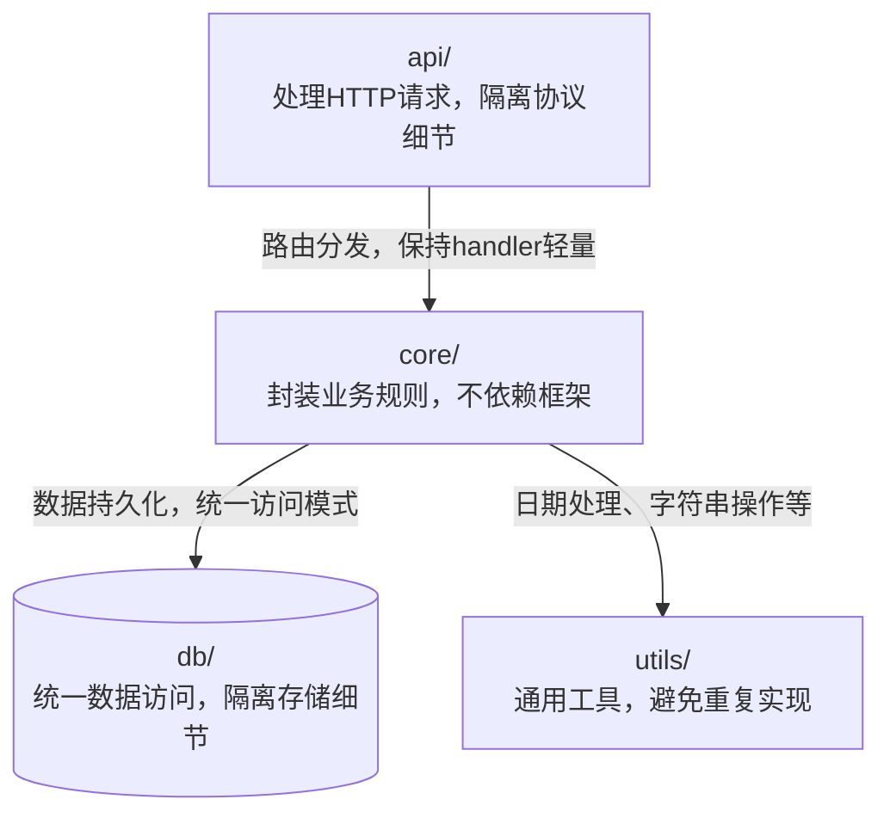
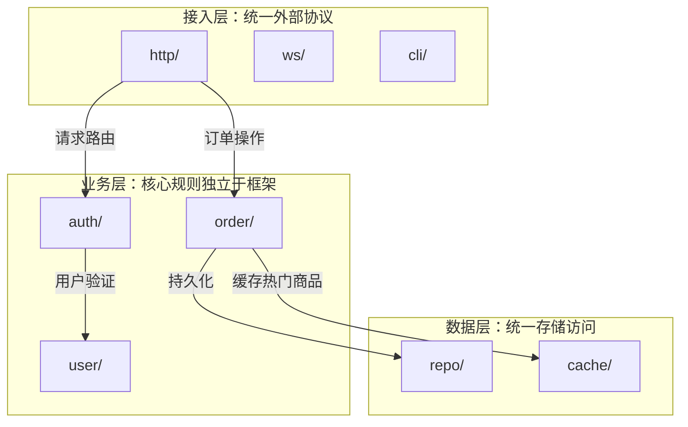
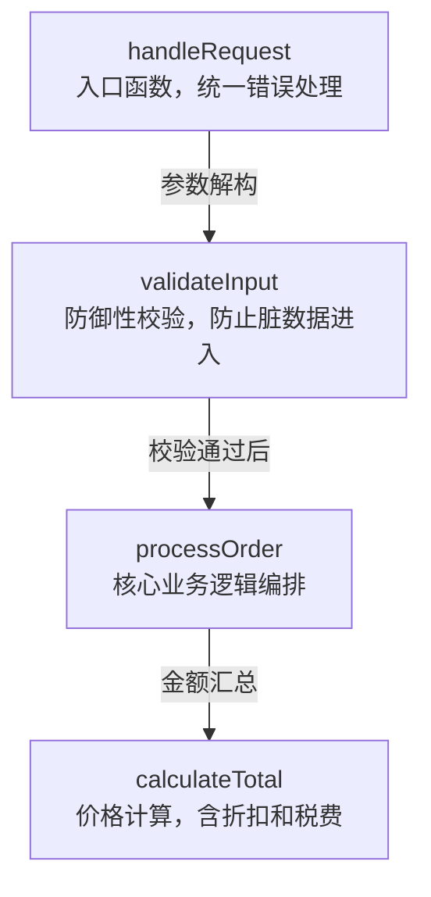

# WHY-Driven Diagram Annotations — Design Spec

> Date: 2026-05-14

## Goal

Upgrade project-xray-skills diagrams from "showing structure" to "explaining design decisions" by adding WHY annotations to architecture and functional flow diagrams.

## Decisions

| Decision | Choice |
|----------|--------|
| Annotation location | Both nodes and edges |
| WHY source | Agent infers from code analysis |
| Diagram format | Mermaid node label inline |
| Applicable diagram types | Architecture + Functional Flow only |
| Depth levels | Architecture + Deep (Overview excluded) |
| Large project handling | Subgraph grouping when modules > 20 |

## Trigger Rules

| Condition | Behavior |
|-----------|----------|
| Diagram type = Architecture or Functional Flow | Enable WHY annotations |
| Depth = Overview | No WHY — keep lightweight |
| Depth = Architecture | Node: role description ≤15 chars; Edge: dependency reason ≤20 chars |
| Depth = Deep | Node: ≤25 chars; Edge: ≤30 chars (more detailed) |
| Module count ≤ 20 | Inline label method |
| Module count > 20 | Subgraph grouping method |

## Node WHY Inference

Agent reads module entry files, exported APIs, and key functions, then answers: **What is the core reason this module exists?**

Inference priority:
1. Module README or docstring has explicit description → quote directly
2. Infer from module's exported API and call patterns →归纳为一句话
3. Infer from module name and directory structure → lowest confidence

Concrete steps:
1. `Read` the module's entry file (index.ts, mod.rs, __init__.py, etc.)
2. `Grep` for exported functions/classes to understand public API
3. `Grep` for who imports this module to understand its consumers
4. Synthesize: "This module exists because [consumers] need [capability]"

Output constraints:
- Must answer "why", not just describe "what"
- Good: "封装业务规则，不依赖框架"
- Bad: "包含核心业务逻辑" (this is WHAT, not WHY)

## Edge WHY Inference

For each dependency A → B, agent answers: **Why does A need B?**

Inference method:
1. `Grep` A's source for import statements referencing B
2. Identify which B functions/classes A actually calls
3. Categorize the relationship: data access / validation / utility / orchestration / etc.
4. Summarize in one phrase

Output constraints:
- Good: "调用验证函数，确保输入合法"
- Bad: "依赖 B" (no information value)

## Large Project Subgraph Grouping

When modules > 20, auto-group by architectural layer:

| Group | Detection Criteria |
|-------|-------------------|
| 接入层 | Handles HTTP/CLI/WebSocket protocols (imports express/fastify/cobra, exports route handlers) |
| 业务层 | Core business logic, framework-independent (no framework imports, exports business functions) |
| 数据层 | Database, cache, file I/O (imports ORM/redis/fs, exports CRUD operations) |
| 工具层 | Utilities, constants, type definitions (no business logic, pure functions or type exports) |
| 外部集成 | Third-party API calls, SDK wrappers (imports stripe/twilio/s3, exports client wrappers) |

Detection method:
1. `Grep` each module's imports for framework/service keywords
2. Check exported API patterns (route handlers vs CRUD vs pure functions)
3. Assign to the best-matching layer; ambiguous modules go to 业务层 by default

Subgraph title format: `subgraph "层名：一句话定位"`

## Example Outputs

### Architecture (≤20 modules)

### Architecture (>20 modules, subgraph)

### Functional Flow

## Files to Modify

| File | Changes |
|------|---------|
| `SKILL.md` | Add WHY annotation rules section: trigger conditions, format constraints |
| `references/architecture.md` | Add WHY inference steps, subgraph grouping logic, updated Mermaid templates |
| `references/functional-flow.md` | Add function-level WHY inference steps, updated Mermaid templates |
| `templates/report-template.md` | Update examples to show WHY-annotated diagrams |

## Out of Scope

- Data flow diagrams (WHY less meaningful for data transformation steps)
- User interaction diagrams (WHY less meaningful for navigation flows)
- Overview depth level (keep lightweight)
- Interactive WHY editing (future enhancement)
- WHY confidence scoring (future enhancement)
