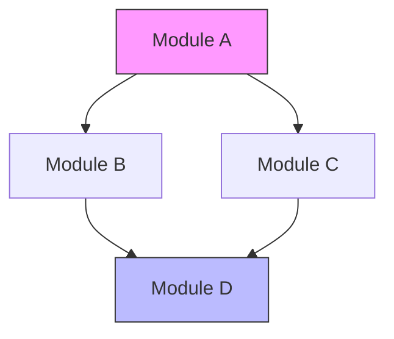
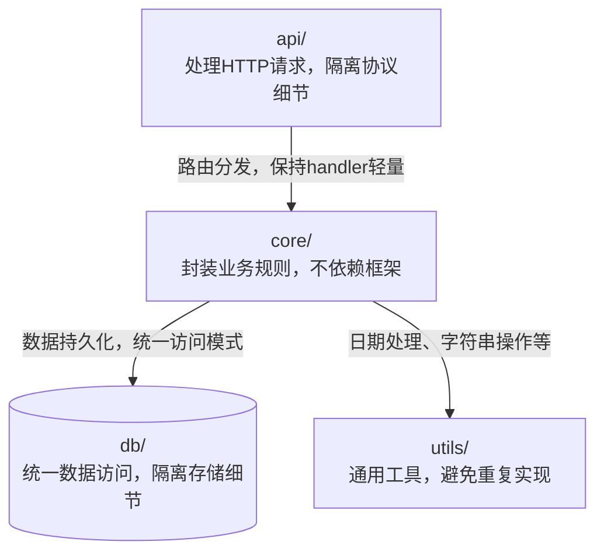
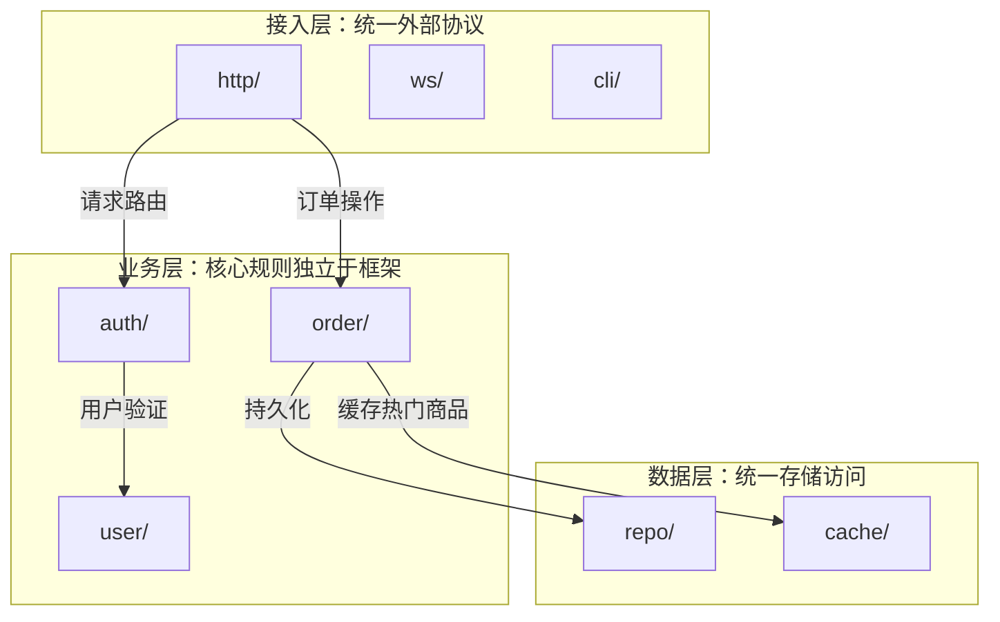
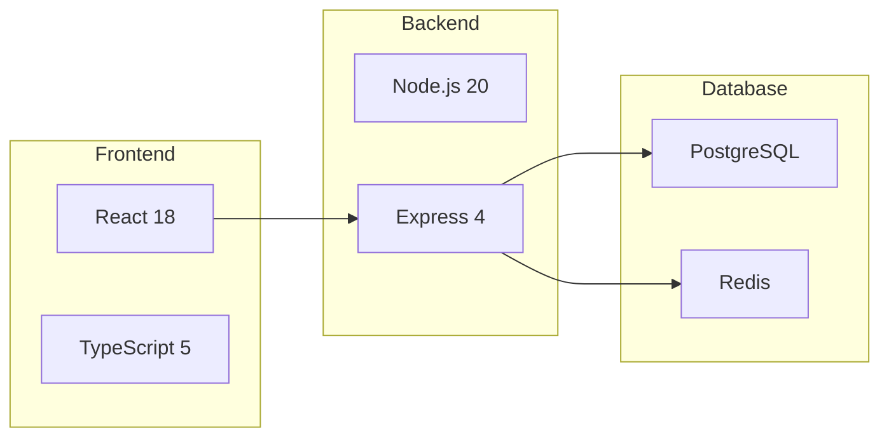
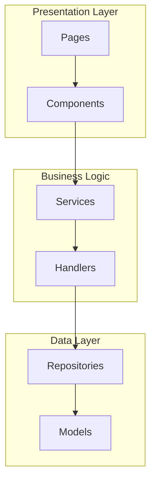
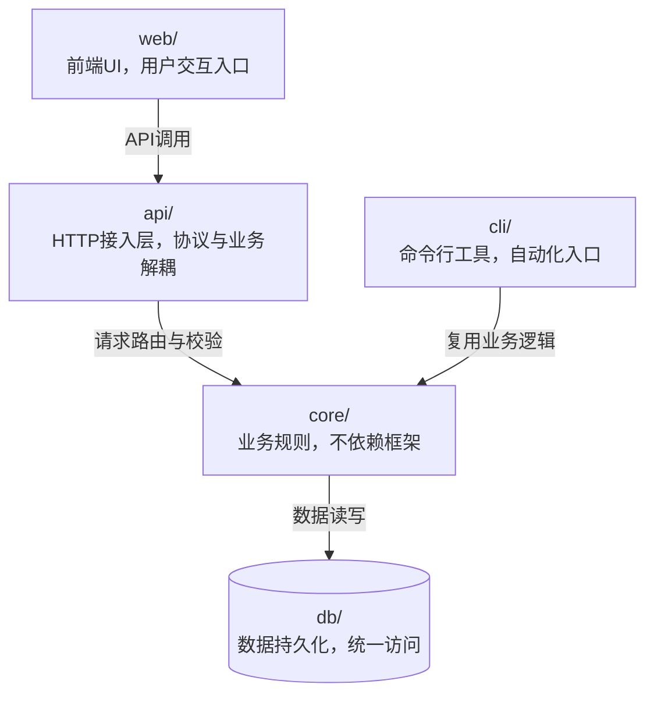

# Architecture Analysis

Analyze and visualize a project's module structure, dependencies, and tech stack.

## Analysis Steps

### Step 1: Identify Tech Stack

Read the project's config files to determine:
- Primary language(s)
- Framework(s)
- Build tool(s)
- Package manager(s)

Common config files to check:
- `package.json` → Node.js, npm/yarn/pnpm
- `Cargo.toml` → Rust, cargo
- `go.mod` → Go
- `pyproject.toml` / `setup.py` → Python
- `pom.xml` / `build.gradle` → Java
- `Gemfile` → Ruby
- `composer.json` → PHP

### Step 2: Map Module Boundaries

1. `Glob` for top-level directories under `src/`, `lib/`, `pkg/`, or project root
2. For each module directory, `Read` its `index.ts` / `mod.rs` / `__init__.py` / `index.go` to understand its public API
3. `Grep` for import patterns to find cross-module dependencies:
   - TypeScript: `from '...'` or `import ... from`
   - Python: `from ... import` or `import`
   - Go: `import (...)`
   - Rust: `use ...` or `mod ...`

### Step 3: Identify Entry Points

Find the application's entry points:
- Main files: `main.ts`, `main.py`, `main.go`, `main.rs`, `index.ts`
- CLI entry: `bin/`, `cmd/`
- Web entry: `app.ts`, `server.ts`, `wsgi.py`
- Library entry: `lib.ts`, `mod.rs`, `index.ts`

### Step 4: Identify Key Abstractions

Look for:
- Core interfaces/types/traits
- Service classes
- Repository patterns
- Middleware layers
- Plugin/extension systems

### Step 5: Infer Module WHY (Architecture + Deep only)

For each module identified in Steps 2-4, infer **why it exists** (not what it does).

**For each module node:**
1. `Read` the module's entry file (index.ts, mod.rs, __init__.py, etc.)
2. `Grep` for exported functions/classes to understand its public API
3. `Grep` for who imports this module to understand its consumers
4. Synthesize a one-line WHY: "This module exists because [consumers] need [capability]"

**For each dependency edge A → B:**
1. `Grep` A's source for import statements referencing B
2. Identify which B functions/classes A actually calls
3. Categorize: data access / validation / utility / orchestration / etc.
4. Summarize in one phrase

**Quality constraints:**
- Must answer "why", not just describe "what"
- Good node WHY: "处理HTTP请求，隔离协议细节"
- Bad node WHY: "HTTP请求处理模块" (this is WHAT)
- Good edge WHY: "调用验证函数，确保输入合法"
- Bad edge WHY: "依赖core" (no information)

**Large project grouping (>20 modules):**

Auto-group modules by architectural layer:

| Layer | Detection |
|-------|-----------|
| 接入层 | Imports express/fastify/cobra, exports route handlers |
| 业务层 | No framework imports, exports business functions |
| 数据层 | Imports ORM/redis/fs, exports CRUD operations |
| 工具层 | Pure functions or type exports, no business logic |
| 外部集成 | Imports stripe/twilio/s3, exports client wrappers |

Detection: `Grep` each module's imports for framework/service keywords, check exported API patterns. Ambiguous modules → 业务层.

Subgraph title format: `subgraph "层名：一句话定位"`

## Diagram Templates

### Module Dependency Graph (Overview — no WHY)



### Module Dependency Graph (Architecture/Deep — with WHY, ≤20 modules)



### Module Dependency Graph (Architecture/Deep — with WHY, >20 modules, subgraph)



### Tech Stack Overview



### Component Architecture (Deep)



## Depth Configuration

| Depth | What to Include | WHY Annotations |
|-------|----------------|-----------------|
| Overview | Top-level modules only, tech stack, entry points | No |
| Architecture | Module dependencies, API surface, data models | Yes — node ≤15 chars, edge ≤20 chars |
| Deep | Sub-module structure, key classes, interface contracts | Yes — node ≤25 chars, edge ≤30 chars |

## Example Output

For a typical Node.js project (Architecture depth, with WHY):

```markdown
## Architecture Overview

**Tech Stack:** TypeScript, React 18, Express 4, PostgreSQL

### Module Structure



### Key Entry Points
- `api/server.ts` — HTTP API server
- `web/src/index.tsx` — React frontend entry
- `cli/index.ts` — CLI tool entry
```
