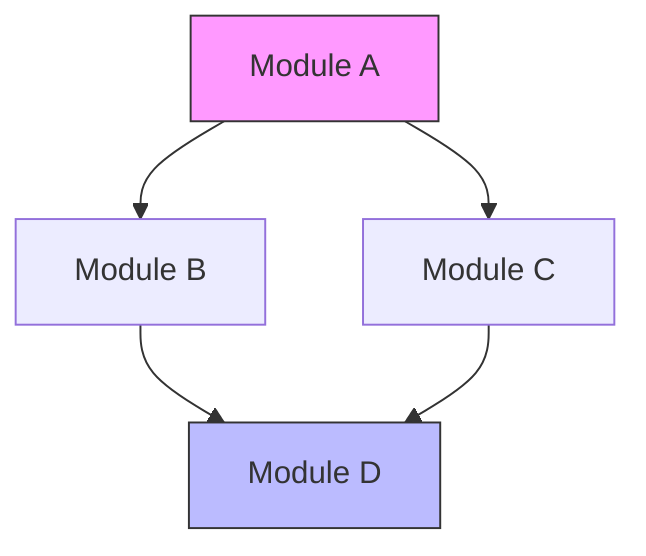
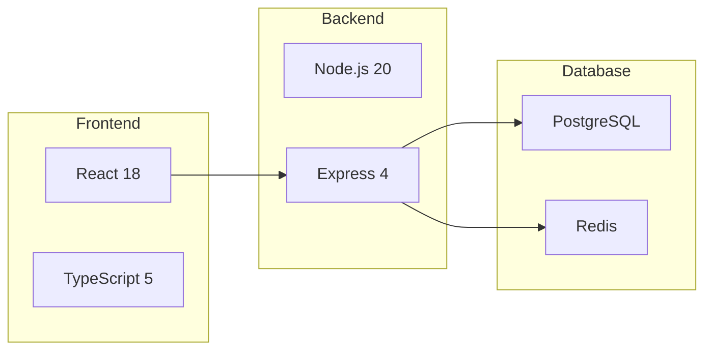
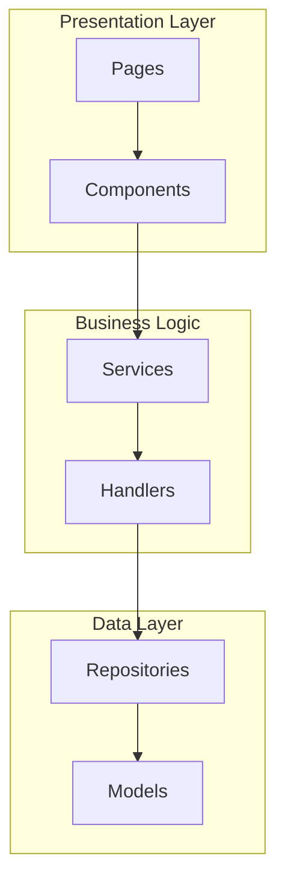
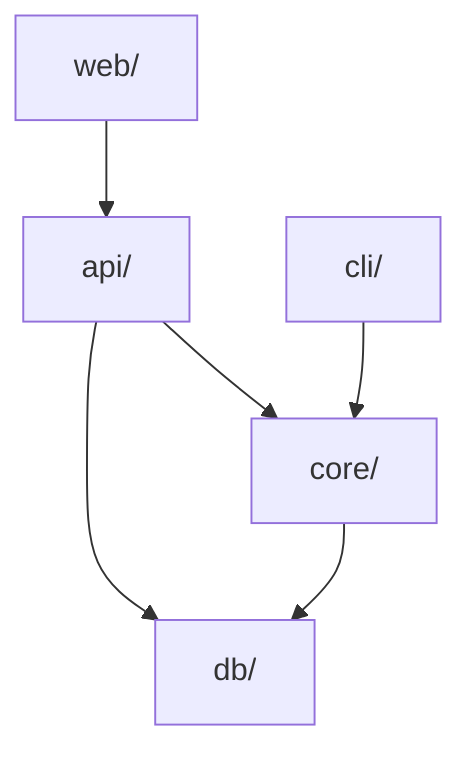

# Architecture Analysis

Analyze and visualize a project's module structure, dependencies, and tech stack.

## Analysis Steps

### Step 1: Identify Tech Stack

Read the project's config files to determine:
- Primary language(s)
- Framework(s)
- Build tool(s)
- Package manager(s)

Common config files to check:
- `package.json` → Node.js, npm/yarn/pnpm
- `Cargo.toml` → Rust, cargo
- `go.mod` → Go
- `pyproject.toml` / `setup.py` → Python
- `pom.xml` / `build.gradle` → Java
- `Gemfile` → Ruby
- `composer.json` → PHP

### Step 2: Map Module Boundaries

1. `Glob` for top-level directories under `src/`, `lib/`, `pkg/`, or project root
2. For each module directory, `Read` its `index.ts` / `mod.rs` / `__init__.py` / `index.go` to understand its public API
3. `Grep` for import patterns to find cross-module dependencies:
   - TypeScript: `from '...'` or `import ... from`
   - Python: `from ... import` or `import`
   - Go: `import (...)`
   - Rust: `use ...` or `mod ...`

### Step 3: Identify Entry Points

Find the application's entry points:
- Main files: `main.ts`, `main.py`, `main.go`, `main.rs`, `index.ts`
- CLI entry: `bin/`, `cmd/`
- Web entry: `app.ts`, `server.ts`, `wsgi.py`
- Library entry: `lib.ts`, `mod.rs`, `index.ts`

### Step 4: Identify Key Abstractions

Look for:
- Core interfaces/types/traits
- Service classes
- Repository patterns
- Middleware layers
- Plugin/extension systems

## Diagram Templates

### Module Dependency Graph



### Tech Stack Overview



### Component Architecture (Deep)



## Depth Configuration

| Depth | What to Include |
|-------|----------------|
| Overview | Top-level modules only, tech stack, entry points |
| Architecture | Module dependencies, API surface, data models |
| Deep | Sub-module structure, key classes, interface contracts |

## Example Output

For a typical Node.js project:

```markdown
## Architecture Overview

**Tech Stack:** TypeScript, React 18, Express 4, PostgreSQL

### Module Structure



### Key Entry Points
- `api/server.ts` — HTTP API server
- `web/src/index.tsx` — React frontend entry
- `cli/index.ts` — CLI tool entry
```
