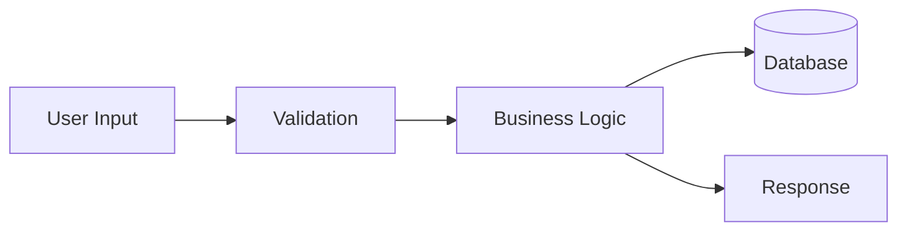
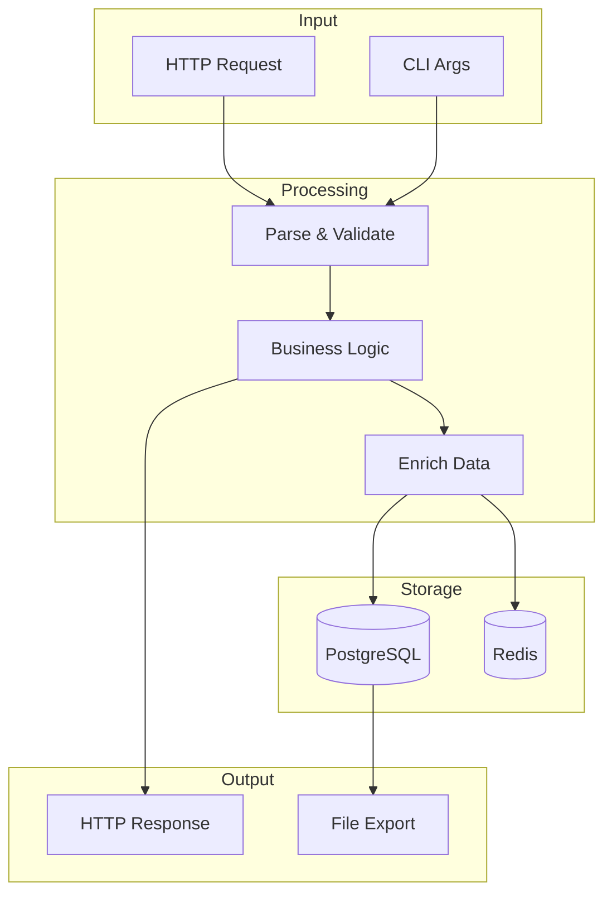
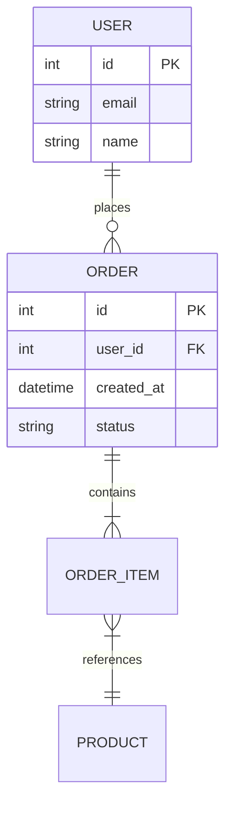
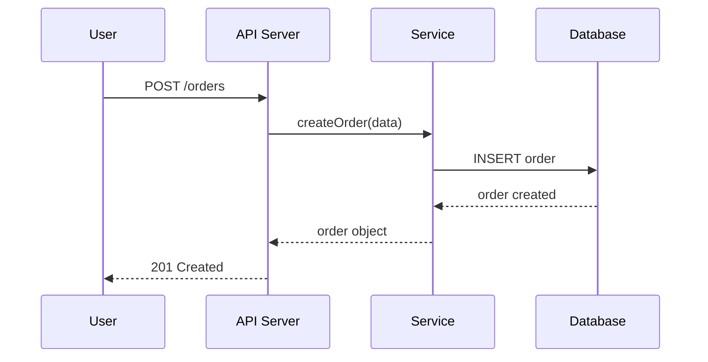
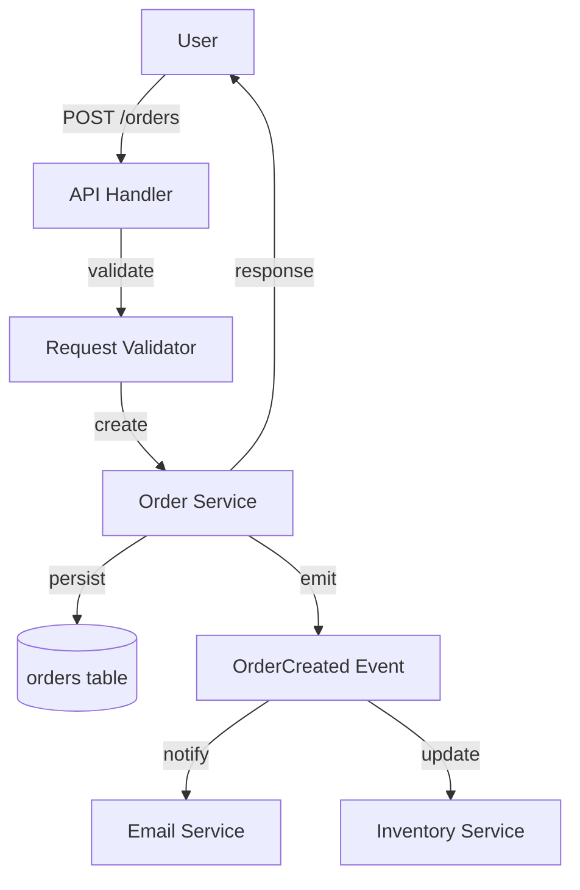
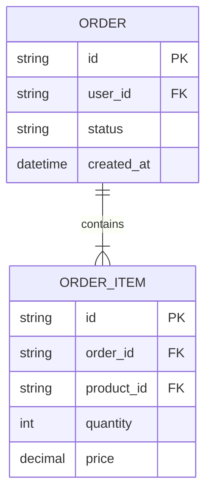

# Data Flow Analysis

Trace how data moves through a system — from input to transformation to output.

## Analysis Steps

### Step 1: Identify Data Entry Points

Find where external data enters the system:
- HTTP handlers / controllers / routes
- CLI argument parsing
- File readers / importers
- Message queue consumers
- Webhook receivers
- Database queries (read side)

`Grep` for patterns:
- `req.body`, `req.params`, `req.query` (Express)
- `request.json()`, `request.form` (Python web)
- `os.Args`, `flag.Parse()` (Go CLI)
- `stdin`, `input()` (general)

### Step 2: Trace Data Transformations

For each entry point, follow the data:
1. What validation/parsing happens?
2. What business logic transforms it?
3. What intermediate data structures are created?
4. What serialization/deserialization occurs?

`Grep` for patterns:
- Validation: `validate`, `schema`, `parse`, `sanitize`
- Transform: `map`, `filter`, `reduce`, `transform`, `convert`
- Serialization: `JSON.stringify`, `json.dumps`, `marshal`, `serialize`

### Step 3: Identify Data Storage

Find where data is persisted:
- Database operations: `INSERT`, `UPDATE`, `save`, `create`, `update`
- File writes: `writeFile`, `write`, `open(..., 'w')`
- Cache: `set`, `put`, `store`
- External API calls: `fetch`, `axios`, `requests.post`

### Step 4: Identify Data Outputs

Find where data leaves the system:
- HTTP responses: `res.json`, `res.send`, `return Response`
- File exports: CSV, JSON, PDF generation
- Message queue producers
- WebSocket pushes
- CLI output: `console.log`, `print`, `fmt.Println`

### Step 5: Map the Complete Flow

Connect entry → transform → store → output into a coherent flow.

## Diagram Templates

### High-Level Data Flow



### Detailed Data Flow



### Data Model (ER Diagram)



### Sequence Diagram (Deep)



## Depth Configuration

| Depth | What to Include |
|-------|----------------|
| Overview | Main data sources and sinks, high-level flow |
| Architecture | Transformation steps, storage details, data models |
| Deep | Field-level flow, validation rules, error paths |

## Example Output

```markdown
## Data Flow: Order Processing



### Data Model

```
