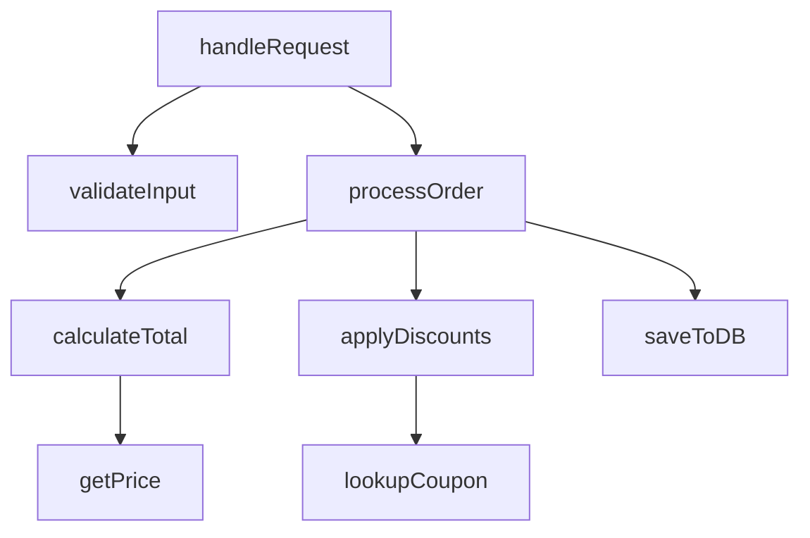
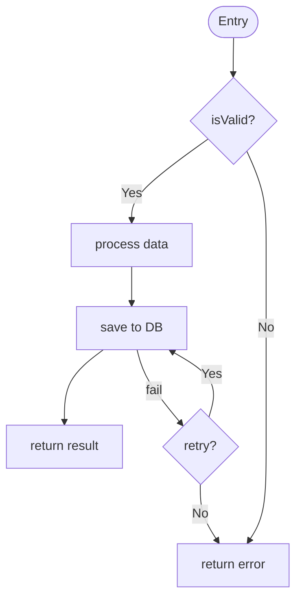
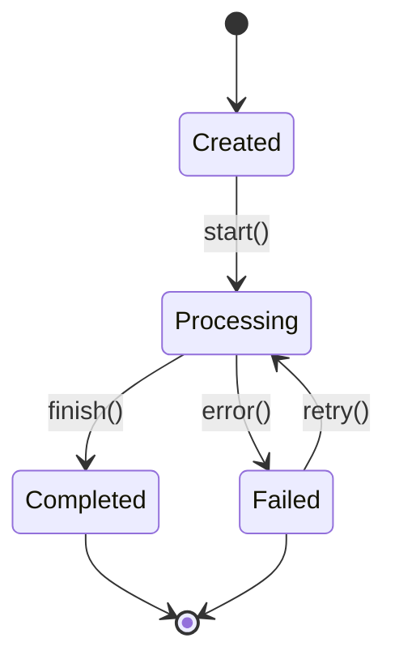
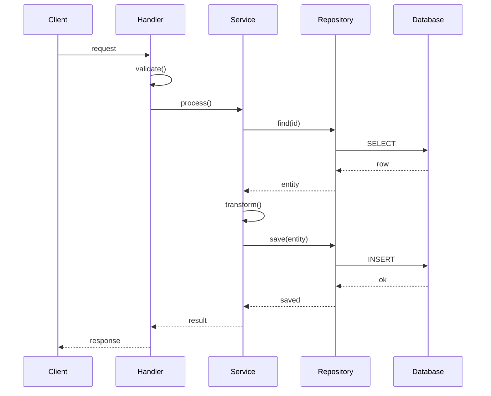
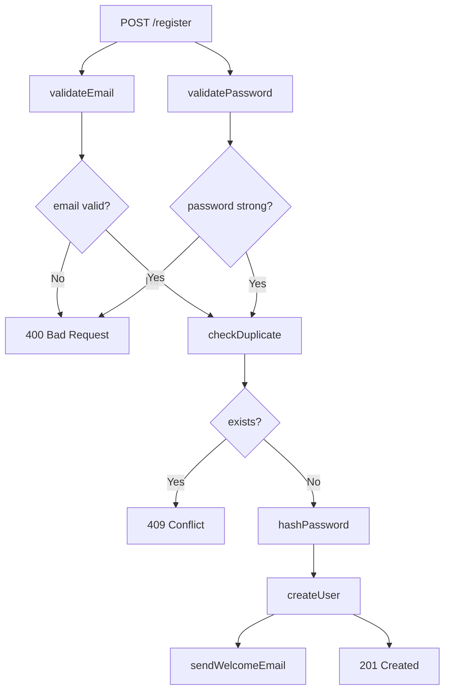
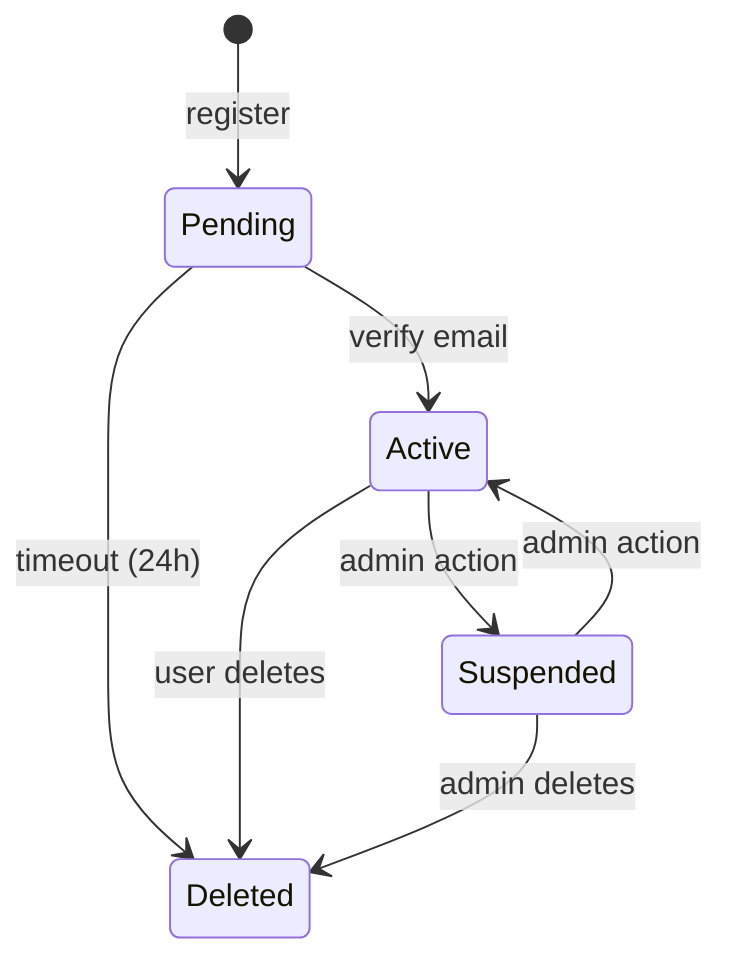

# Functional Flow Analysis

Analyze and visualize the core business logic — function call chains, control flow, and state transitions.

## Analysis Steps

### Step 1: Identify Core Functions

Find the main business logic functions:
1. Start from entry points (routes, handlers, main functions)
2. Follow the call chain one level deep
3. Identify the "core" functions that do the real work (not just routing/dispatch)

`Grep` for patterns:
- Function definitions: `function `, `def `, `func `, `fn `, `pub fn`
- Class methods: `async `, `public `, `private `
- Exported functions: `export function`, `export const`, `export default`

### Step 2: Map Function Call Chains

For each core function:
1. Read the function body
2. List all functions it calls
3. For significant callees, read their implementation
4. Continue until you reach leaf functions (no further meaningful calls)

### Step 3: Analyze Control Flow

Within each function, identify:
- **Branches:** if/else, switch/match, ternary
- **Loops:** for, while, forEach, map/filter/reduce
- **Error handling:** try/catch, Result/Option, error returns
- **Early returns:** guard clauses, validation failures

### Step 4: Identify State Transitions

Look for state machines:
- Status fields that change (e.g., `order.status = 'shipped'`)
- State pattern implementations
- Workflow engines
- Enum-based state machines

### Step 5: Find Side Effects

Identify functions that:
- Write to database
- Send HTTP requests
- Emit events/messages
- Modify global state
- Read/write files

## Diagram Templates

### Function Call Chain



### Control Flow (Detailed)



### State Machine



### Sequence Diagram



## Depth Configuration

| Depth | What to Include |
|-------|----------------|
| Overview | Top-level function names and their purpose |
| Architecture | Call chains, key branching logic, side effects |
| Deep | Full control flow, every branch, error paths, state machines |

## Example Output

```markdown
## Functional Flow: User Registration



### State: User Account

