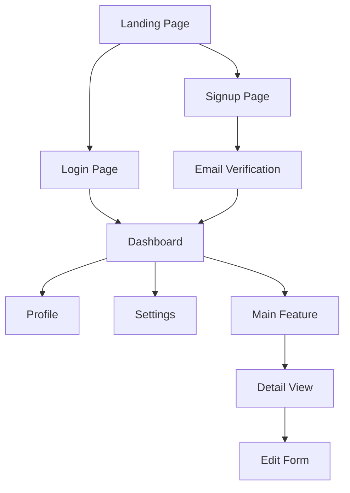
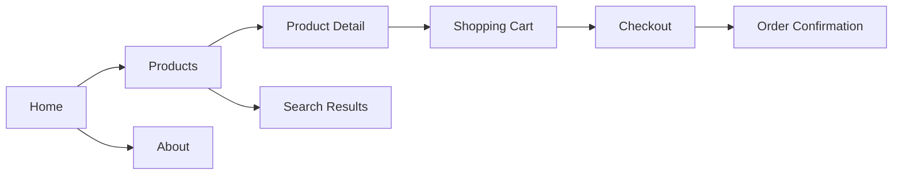
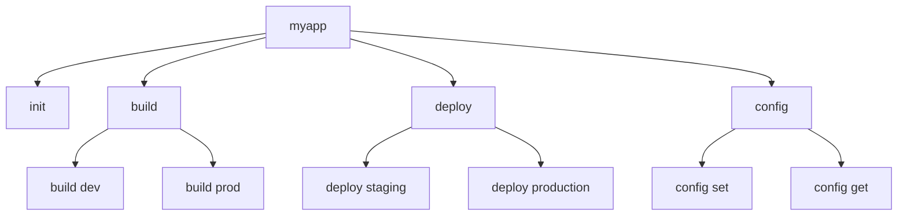
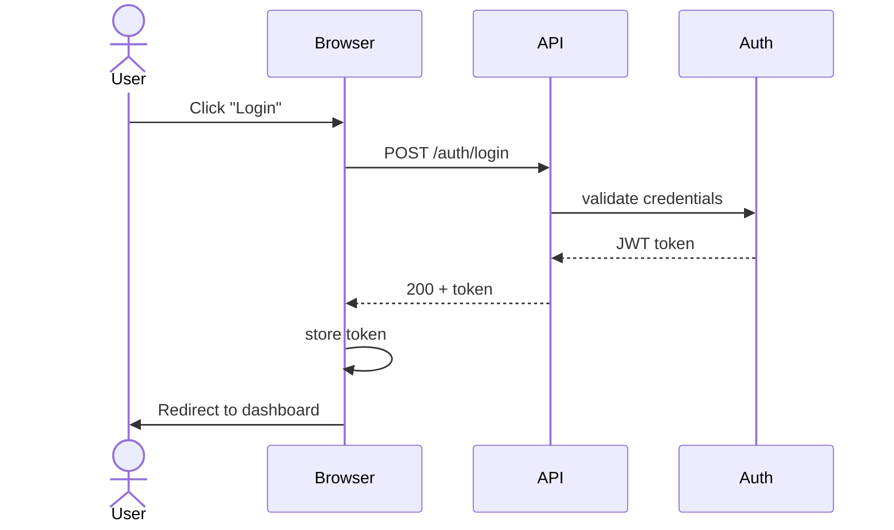
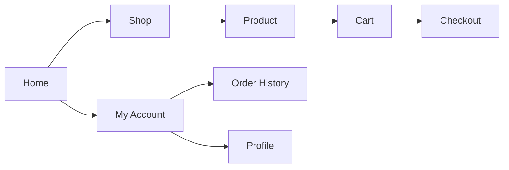
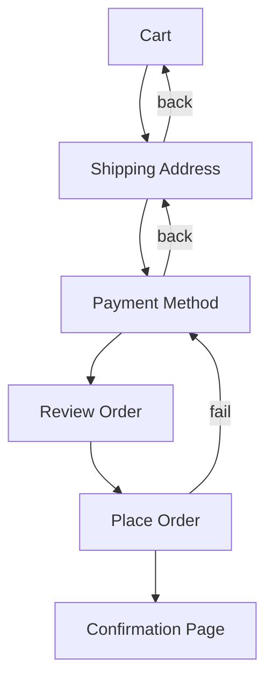

# User Interaction Flow Analysis

Map how users interact with the system — entry points, navigation paths, and interaction sequences.

## Analysis Steps

### Step 1: Identify User Entry Points

Find all ways users can interact with the system:
- Web routes/pages
- CLI commands and subcommands
- API endpoints (if user-facing)
- WebSocket connections
- Mobile app screens

`Grep` for patterns:
- Web routes: `app.get`, `app.post`, `router.`, `Route(`, `@app.route`
- CLI commands: `command(`, `add_command`, `Command(`, `cobra.Command`
- Pages: `pages/`, `views/`, `templates/`, `screens/`

### Step 2: Map Navigation Paths

For web apps:
1. Find all routes/pages
2. Identify links between pages (`<Link>`, `href`, `navigate`, `router.push`)
3. Map form submissions and their targets
4. Identify redirect chains

For CLI apps:
1. Find all commands and subcommands
2. Map command dependencies (which commands need others first)
3. Identify interactive prompts

For APIs:
1. List all endpoints
2. Map typical usage sequences (what order do clients call them?)

### Step 3: Identify User Flows

Group interactions into meaningful user flows:
- Authentication flow (login → dashboard)
- CRUD flows (list → create → edit → delete)
- Onboarding flow
- Settings/configuration flow
- Error recovery flows

### Step 4: Analyze Feedback Mechanisms

Find how the system communicates with users:
- Success/error messages
- Loading states
- Notifications
- Form validation feedback
- Toast/alert messages

## Diagram Templates

### User Flow (Web App)



### Navigation Map



### CLI Command Tree



### Interaction Sequence (Deep)



## Depth Configuration

| Depth | What to Include |
|-------|----------------|
| Overview | Main entry points and top-level navigation |
| Architecture | All routes/pages, user flow groupings |
| Deep | Every link, form, redirect, feedback mechanism |

## Example Output

```markdown
## User Interaction Flow: E-Commerce App

### Main Navigation


### Checkout Flow

```
